# Market Analysis Report For A National Clothing Chain
A Udacity Power BI project on an online clothing store

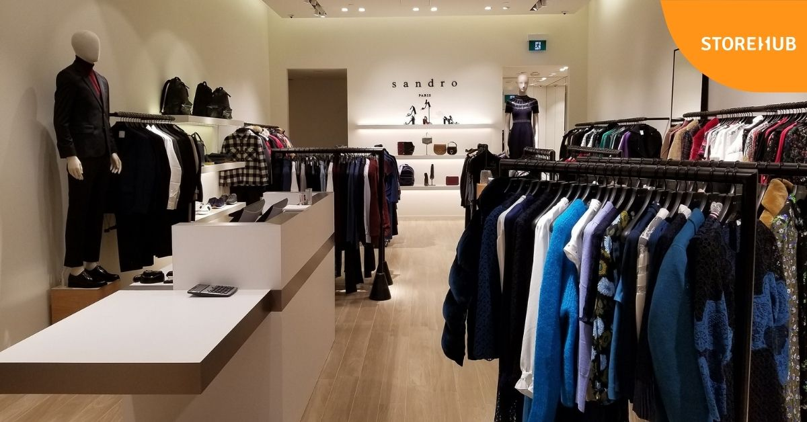

## Introduction
An online national clothing chain needs your help creating a targeted marketing campaign. Sales have been flat and they want to lure lost customers back. They want to advertise specific products to specific customers in specific locations, but they don’t know who to target. They have three products in mind:
- Shirt: $25
- Sweater: $100
- Leather Bag: $1,000

They need you to conduct an analysis to determine the best product to advertise to each customer.

## Project Instructions
In this project, you will use population statistics from the US Census Bureau to determine where the greatest income exists around the country and whether there is a correlation between sales and income. We don’t know the incomes of our customers, but we should be able to predict it by looking at their purchase history and locations and comparing that against the census data. Additionally, we want to analyze our inventory, specifically customer ratings and return rate and see if there’s a correlation between the two.

## Analysis Questions:

1. What is the correlation (R2 value) between sales and income?
2. What is the correlation (R2 value) between customer ratings and product return rate?
3. What are the linear regression formulas to predict customer income from customer sales?
4. Which customer do you predict has the highest income?
5. Which product will be advertised the most?

## Data Sourcing
The project will use a variety of data sources, many of which were provided by Udacity and data on weather which will be sourced online.

### US Census Bureau
- Average income
- location
- population
- industry

### Business Data
- Product inventory
- Product prices
- Customer rating
- Product return rate

### Customer Data
- Customer ID
- Names
- Location
- Date of birth
- Purchase history

### Additional Data
[Weather](https://www.currentresults.com/Weather/US/average-annual-state-temperatures.php#:~:text=Average%20Annual%20Temperature%20for%20Each%20US%20State%20,%20%2030%20%2012%20more%20rows%20)

## Data Transformation

### Product Inventory

Before Cleaning                                           |   After Cleaning
:-------------------------------------------------------: | :-------------------------------------------------------------:
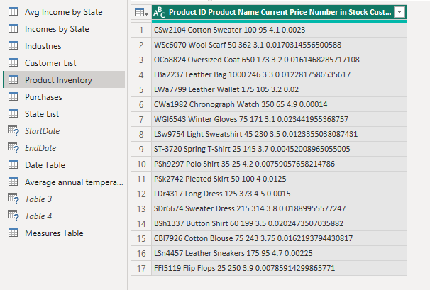                                |   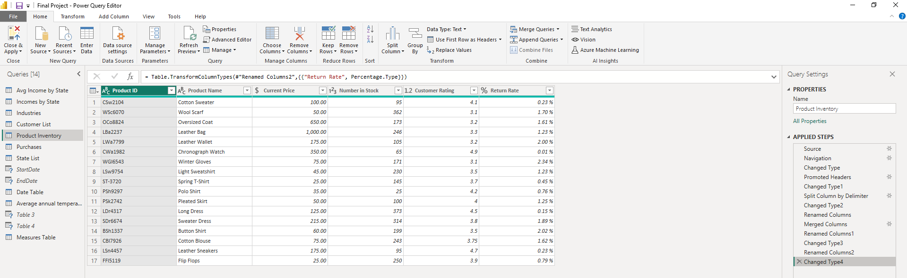

Power Query's split column by Delimiter function was used to split the single-column Product Inventory column into multiple columns, renamed these columns and changed their data types accordingly. 

### Purchase History

Before Cleaning                                           |   After Cleaning
:-------------------------------------------------------: | :-------------------------------------------------------------:
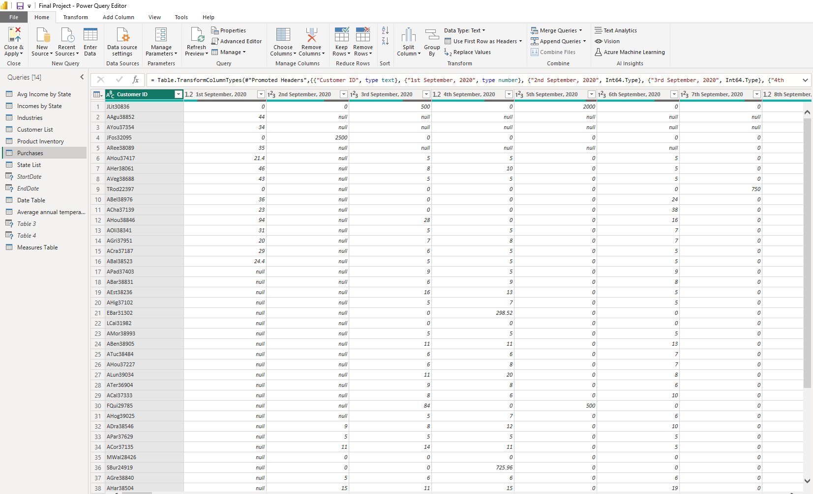                                        |   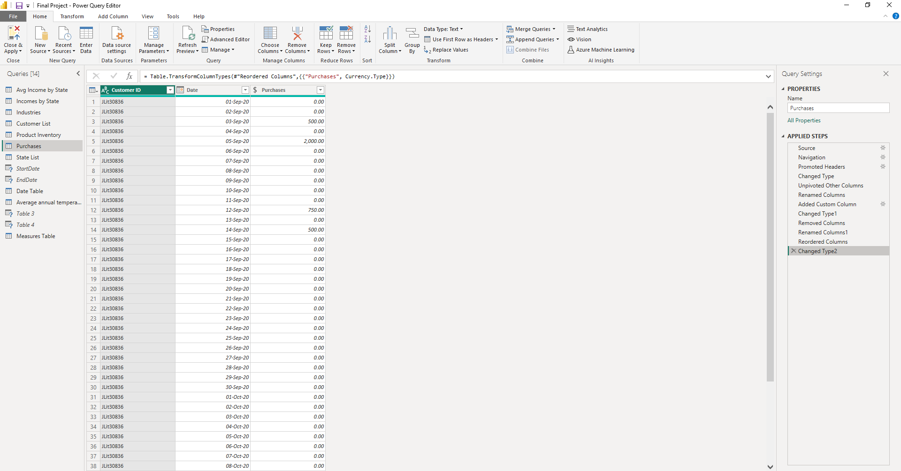

Power Query's unpivot function was used to unpivot the multiple-date columns into two (Attributes and Values), renamed these columns and changed their data types accordingly.

### Date Table
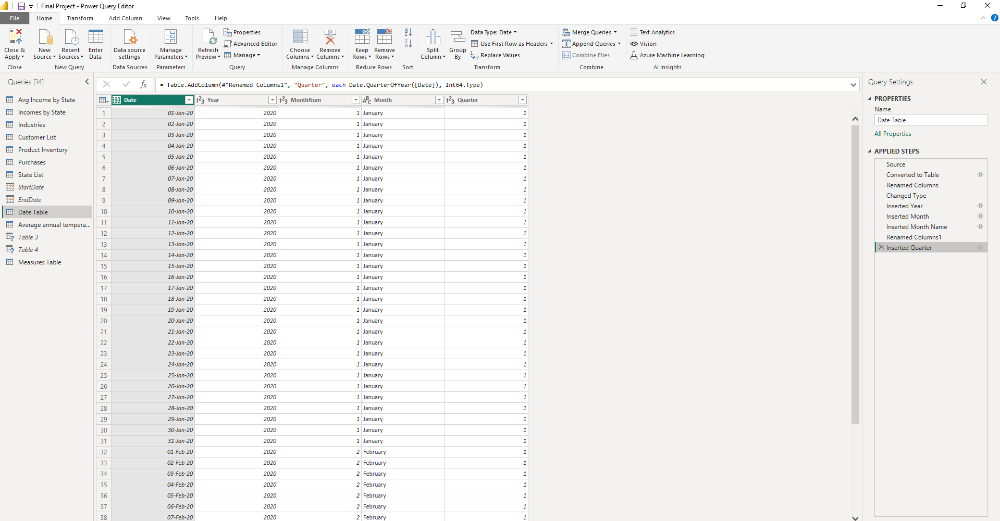

Created a date table in Power Query using _`{Number.From(List.Min(TableName[ColumnName]))..Number.From(List.Max(TableName[ColumnName]))}`_
Creating a date table helps in providing time intelligence analysis.

## Data Modelling
A star schema was used by creating relationship between the necessary tables
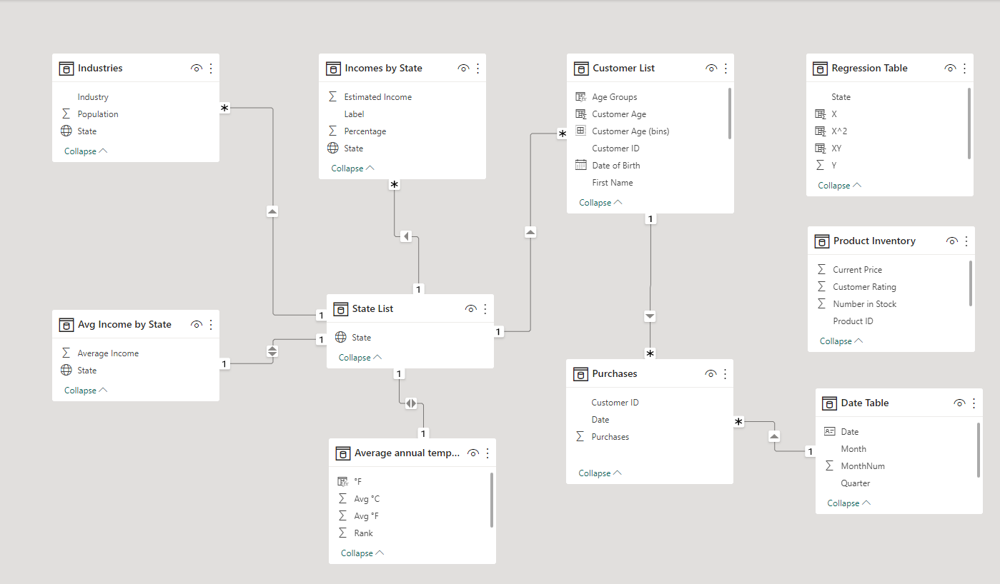

## Analysis & Visualization
The report which can be accessed [here](https://app.powerbi.com/view?r=eyJrIjoiMzliOWEwMjYtNmFiMS00NTYzLWE4ZmUtMTAyMmQxZjFiOWRlIiwidCI6ImE5NjMwYTViLTA5M2EtNDM5Yy04NjM5LThhYmJmMzRhN2M5NyJ9) consists of five pages:
1. Summary
2. Average Income vs Average Sales
3. Customer Analysis
4. Product Analysis
5. Geographical Analysis

### Summary
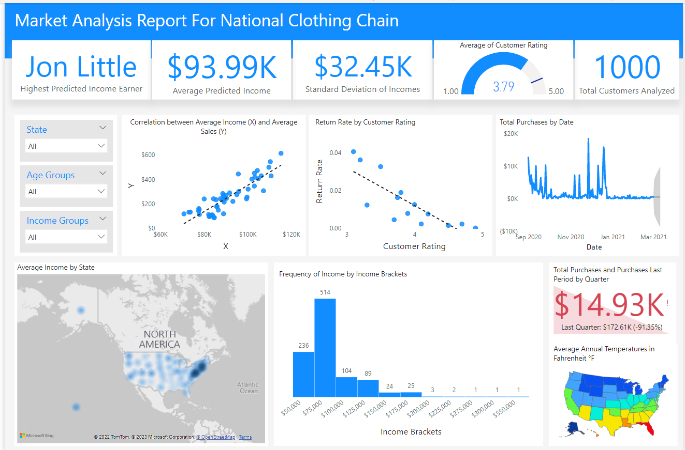

The summary page provide an overview of the solutions to the business problems listed above. It contains visuals from the other four pages with each visual addressing a particular business problem.

### Average Income vs Average Sales
There is a strong positive correlation between Average Income and Sales with a correlation coefficient of **0.78**

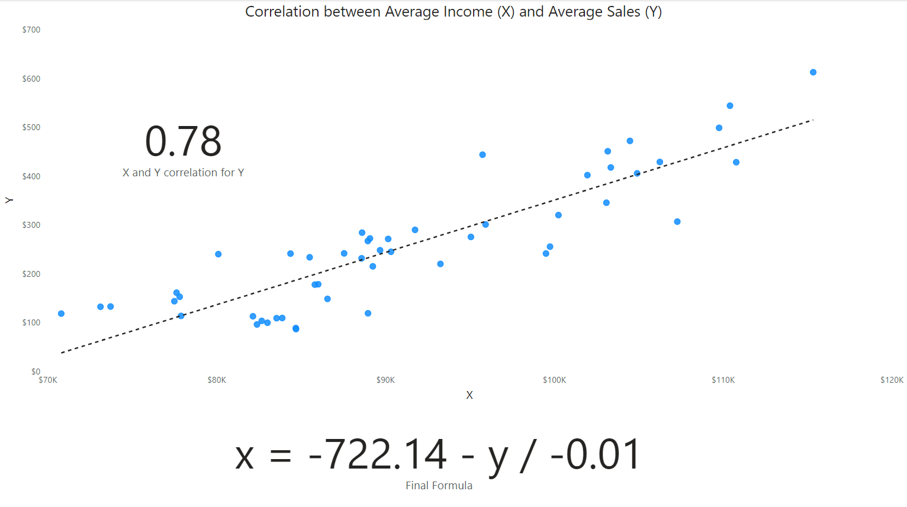

### Customer Analysis
•	Jon Little is predicted to be the highest income earner 💰 . This was achieved using the regression formula: x = -722.14 – y / -m
•	There has been a 91.35% reduction in sales this quarter (Jan – March 2021) as compared to the last quarter (Oct – Dec 2020)
•	About 89% of customers are within the age range of 20 – 50 years.
•	About 71% of customers are medium income earners

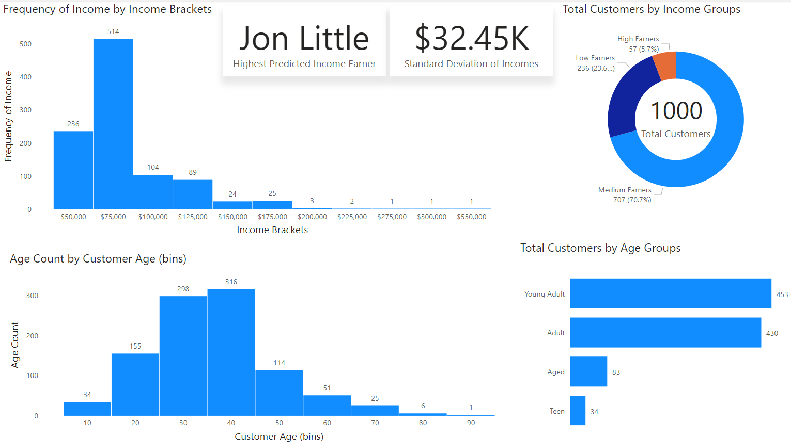

### Product Analysis
•	There is a strong negative correlation between customer ratings and product return rate with a correlation coefficient of **0.69**
•	Chronograph Watch is the best rated product with a rating of **4.90** 
• Winter Gloves and Wool Scarf are the least rated products  with a rating of **3.10**
•	There has been a 91.35% reduction in sales this quarter (Jan – March 2021) as compared to the last quarter (Oct – Dec 2020)

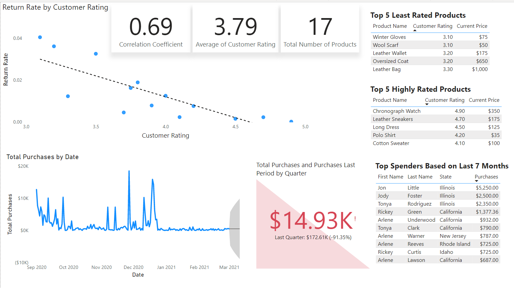

### Geographical Analysis
•	Based on customer transaction data from September 2020 to March 2021, 70% of top 10 customers (spenders) are from Illinois and California
•	District of Columbia, New Jersey, Maryland, Massachusetts and Hawaii are the top 5 states based on average income while Mississippi, West Virginia, Arkansas, Kentucky and New Mexico are the bottom 5 states based on average income.
• California, Texas, Florida, New York, Illinois, Pennyslvania, Ohio, Georgia, North Carolina and Mechigan are the Top 10 most populated cities.

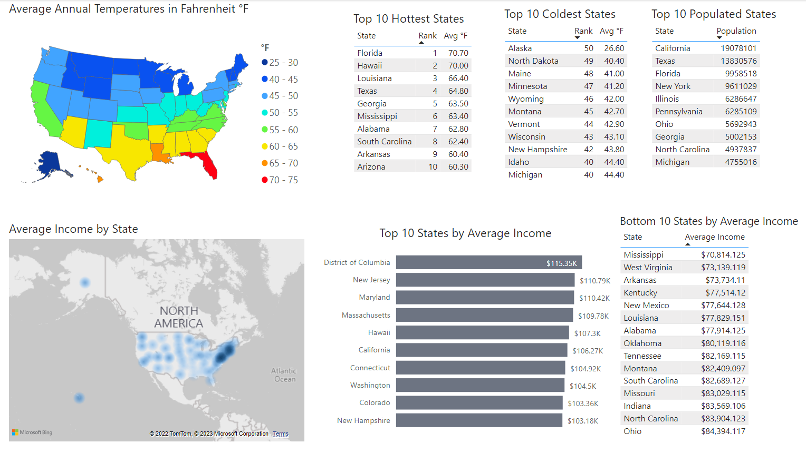

## Recommendation
- Leather bag is one of the least rated products. Customers’ comments and feedbacks should be held succinctly, and efforts geared toward making the necessary improvement. For this reason, I suggest that among the three suggested products, Leather bag should be advertised the most and if possible, the price should be reduced a bit. Again, it should be marketed in the higher income states.
- Sweater should be marketed most in the states of Alaska, North Dakota, Maine, Minnesota, Wyoming and the other states marked as coldest states in the analysis.
- Shirts, in all have a favorable rating at a fairly good price. Of all the four different kinds of shirts, Polo Shirt is the best rated product. These products could be marketed in almost all the states.
- Chronograph Watch is highly rated and should be added to the products.
- Fair majority of the customers are in the age range of 20 – 40 years and leather sneakers, another highly rated product is very popular or preferred among this age group so it will be a good business decision to market it alongside the products.

#### Thank You 🤝

